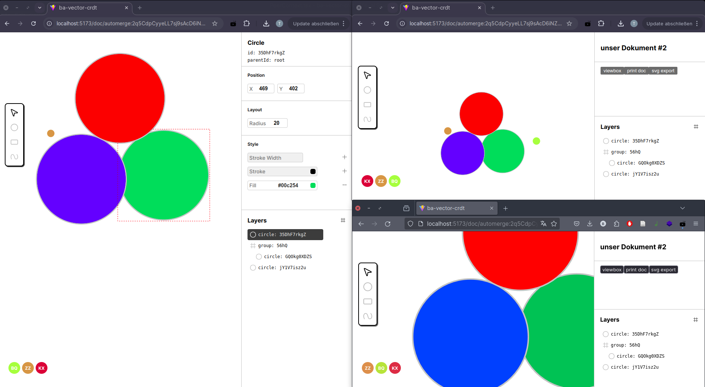

# vecrdt – a simple, collaborative editor for vector graphics made with Automerge CRDTs

A prototype which was programmed as part of my bachelors thesis in order to asses CRDTs in the context of collaborative drawing apps.

## Installation

Clone the project, install its dependencies, and run `yarn dev` to start the local dev server.

```bash
$ git clone https://github.com/stillefront/vecrdt.git
# Cloning into vecrdt...
$ cd vecrdt
$ yarn
# Installing project dependencies...
$ yarn dev
# Starting Vite dev server...
```

Navigate to http://localhost:5173 to see the app running.


